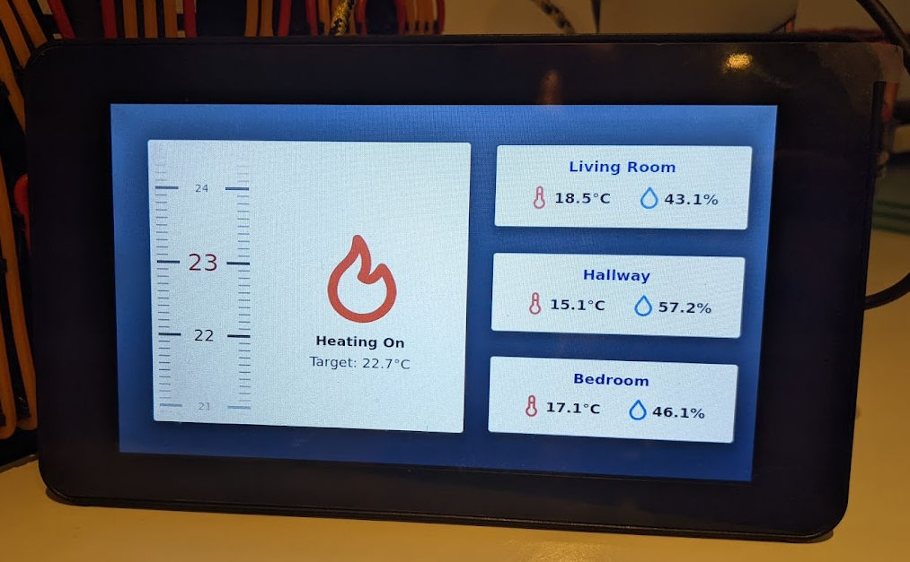

# Flutter Raspberry Pi Home Dashboard

An MQTT home automation dashboard written in Flutter and run using FlutterPi (https://github.com/ardera/flutter-pi) on a RaspberryPi with the official touchscreen.

## Intro

This project has been created for my specific use case and will require modification to fit your own but should be a good starting point for an MQTT backed Dashboard.

## Features

MQTT controls for the following:

  - Thermostat control Set and Display
  - Temperature and Humidity displays for 3 sensors
  - Raspberry Pi display backlight control

## Getting Started

### :hammer_and_wrench: Building and Deploying

1. Follow the steps on the flutter-pi repository (https://github.com/ardera/flutter-pi) to prep your raspberry pi and get a gen_snapshot_linux_x64_release binary on your development machine.

2. Update lib/config.dart this is where you set up mqtt topics and the ip address of your mqtt broker

3. Update compile-and-push-to-pi.sh:
    - FLUTTER_PATH = path to your Flutter SDK 
    - FLUTTERPI_PATH = path to your gen_snapshot_linux_x64_release from step 1
    - PI = your ssh username@ip for your pi (you will need passwordless ssh setup)

4. In terminal run ./compile-and-push-to-pi.sh this will compile the code and rsync it to your pi and start the dashboard.
    - use --release for release build
    - use -k to kill all running flutter-pi projects on the remote raspberry pi
